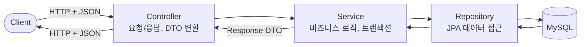
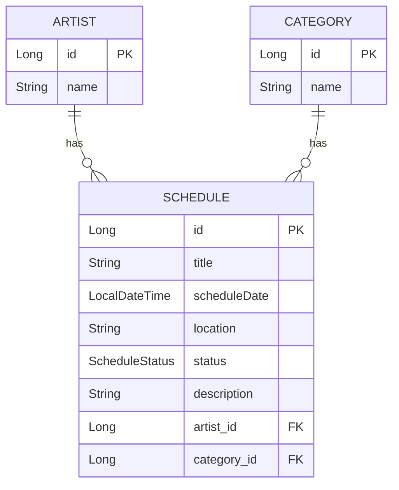
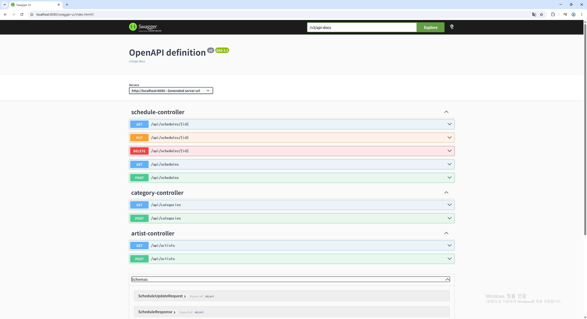
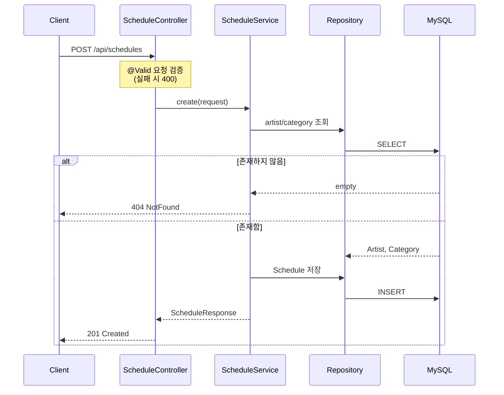
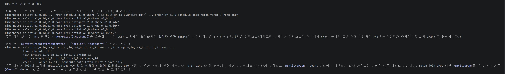
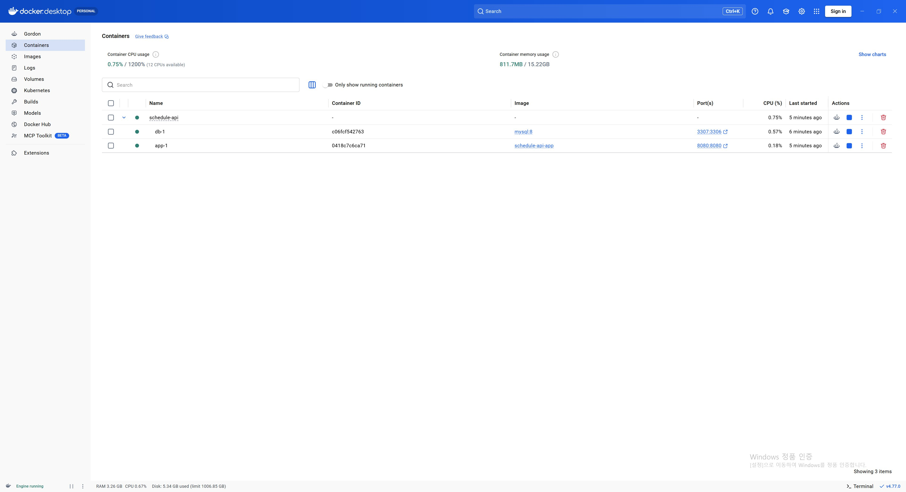

# 📅 schedule-api

아티스트 콘텐츠 일정 관리 REST API. 아티스트별·카테고리별로 일정(콘서트, 음악방송, 팬미팅 등)을 등록·조회·관리한다.

단일 테이블 CRUD를 넘어 **N:1 연관관계 설계와 N+1 문제 해결**까지 다룬 프로젝트로, 연관관계가 있는 도메인에서 JPA가 실제 SQL로 어떻게 동작하는지 확인하고 최적화하는 데 초점을 뒀다.

### ✨ 핵심 구현 포인트

- **N+1 문제를 실제 SQL 로그로 진단하고 `@EntityGraph`로 단일 쿼리화** — 데이터 다양도에 따라 최악 1+2N까지 늘던 쿼리를 1건으로 축소
- **N:1 연관관계를 정규화로 설계하고 응답은 평탄화 DTO로 분리** — Entity 직접 노출 없이 `artistName`/`categoryName`만 노출
- **Docker 멀티스테이지 + Compose로 환경 독립 실행** — healthcheck로 DB 준비 후 앱 기동, 환경 변수로 자격 증명 주입

## 🛠️ 기술 스택

| 구분 | 사용 기술 |
|---|---|
| Language | Java 21 |
| Framework | Spring Boot 4.0, Spring Data JPA, Bean Validation |
| Database | MySQL 8 |
| Docs | springdoc-openapi (Swagger UI) |
| Test | JUnit 5, H2 (인메모리) |
| Infra | Docker, Docker Compose |

## 🎯 주요 기능

- 일정 CRUD (생성/단건 조회/수정/삭제)
- 아티스트·카테고리 등록 및 목록 조회
- 일정 목록 조회: `artistId` / `categoryId` 선택적 필터 + 페이징 + 정렬(기본 일정일시순)
- 연관 엔티티를 평탄화한 응답 DTO (Entity 직접 노출 없음)
- 전역 예외 처리로 일관된 에러 응답
- `@EntityGraph` 기반 N+1 문제 해결

## 🏗️ 아키텍처

요청은 Controller → Service → Repository 순으로 흐르며, 각 계층은 명확히 분리되어 있다. Entity는 외부로 직접 노출되지 않고 응답 DTO로 변환되어 나간다.



## 🗂️ 데이터 모델

Schedule이 Artist, Category와 각각 N:1 관계를 맺는다. 하나의 아티스트/카테고리는 여러 일정을 가질 수 있고, 각 일정은 정확히 한 아티스트와 한 카테고리에 속한다.



아티스트/카테고리 이름을 일정 테이블에 직접 저장하지 않고 별도 테이블로 분리(정규화)했다. 이름이 바뀌어도 참조 테이블 한 행만 수정하면 모든 일정에 반영된다.

## 🔌 API

Swagger UI: `http://localhost:8080/swagger-ui/index.html`

| Method | Endpoint | 설명 |
|---|---|---|
| POST | `/api/schedules` | 일정 생성 |
| GET | `/api/schedules` | 일정 목록 조회 (필터·페이징) |
| GET | `/api/schedules/{id}` | 일정 단건 조회 |
| PUT | `/api/schedules/{id}` | 일정 수정 |
| DELETE | `/api/schedules/{id}` | 일정 삭제 |
| POST | `/api/artists` | 아티스트 등록 |
| GET | `/api/artists` | 아티스트 목록 |
| POST | `/api/categories` | 카테고리 등록 |
| GET | `/api/categories` | 카테고리 목록 |



### 📋 목록 조회 예시

```
GET /api/schedules?artistId=1&categoryId=3&page=0&size=10&sort=scheduleDate,asc
```

응답은 페이징 정보를 담은 형태로 내려간다.

```json
{
  "content": [
    {
      "id": 1,
      "title": "음악중심 출연",
      "scheduleDate": "2026-06-20T15:30:00",
      "location": "MBC 상암",
      "status": "SCHEDULED",
      "description": "생방송",
      "artistId": 1,
      "artistName": "aespa",
      "categoryId": 3,
      "categoryName": "음악방송"
    }
  ],
  "page": 0,
  "size": 10,
  "totalElements": 1,
  "totalPages": 1
}
```

연관 엔티티는 객체가 아니라 `artistName`, `categoryName`처럼 평탄화된 필드로만 노출한다.

### 🔄 일정 생성 처리 흐름

일정 생성 시 요청의 `artistId`/`categoryId`로 연관 엔티티를 조회하고, 존재하지 않으면 404로 응답한다.



## 🔍 트러블슈팅: N+1 문제 해결

일정 목록을 조회할 때, 응답 DTO 변환 과정에서 `schedule.getArtist().getName()`을 호출하는 순간 지연로딩(LAZY)이 초기화되며 **행마다 추가 SELECT가 발생**했다. 목록 1건 + 연관 엔티티 조회 N건 = 1+N 쿼리 문제다.

`ScheduleRepository`의 목록 조회 메서드에 `@EntityGraph(attributePaths = {"artist", "category"})`를 적용해, 본문 쿼리에서 artist·category를 join으로 함께 조회하도록 변경했다.



**수정 전** — 목록 1번 + 연관 엔티티 지연로딩으로 추가 쿼리 발생 (데이터가 다양할수록 최악 1+2N까지 증가)

**수정 후** — 본문 쿼리에 join이 포함되어 단일 쿼리로 조회. count 쿼리에는 join이 적용되지 않아 페이징 카운트는 가벼운 단독 쿼리로 나간다.

> JPQL의 `fetch join` 대신 `@EntityGraph`를 선택한 이유: 기존 `@Query`의 검색 조건(where)은 그대로 두고 로딩 전략만 선언적으로 얹을 수 있기 때문.

관련 통합 테스트: `src/test/java/.../service/ScheduleSearchTest.java` (H2 기반, MySQL 없이 실행 가능)

## 🚀 실행 방법

> 소스 코드는 `schedule-api/` 하위에 있다. 아래 명령은 해당 폴더로 이동한 뒤 실행한다.

```bash
cd schedule-api
```

### 🐳 Docker (권장)

```bash
# 1. 환경 변수 설정
cp .env.example .env
# .env 파일을 열어 DB_PASSWORD, MYSQL_ROOT_PASSWORD를 실제 값으로 수정
# (root 사용 시 두 값을 동일하게 맞출 것)

# 2. 컨테이너 빌드 및 실행 (app + MySQL)
docker-compose up --build
```

앱(8080)과 MySQL(호스트 3307 → 컨테이너 3306) 두 컨테이너가 함께 기동된다. MySQL healthcheck 통과 후 앱이 시작되도록 `depends_on` 조건을 걸어, DB 준비 전 앱이 먼저 떠서 실패하는 문제를 방지했다.



### 💻 로컬 실행

로컬 MySQL에 `scheduledb` 스키마를 만든 뒤:

```bash
# 환경 변수로 DB 접속 정보 주입 (application.properties에 콜론 뒤 로컬 기본값 존재)
DB_PASSWORD=yourpassword ./gradlew bootRun
```

## 📝 설계 노트

- **계층 분리**: Controller -> Service -> Repository
- **DTO 변환**: Entity를 직접 노출하지 않고 `record` 응답 DTO로 변환 (`from()` 정적 팩토리)
- **보안**: DB 자격 증명은 환경 변수로 주입, 평문 하드코딩 없음. `.env`는 git 추적 제외
- **검증**: 요청 DTO에 Bean Validation, 실패 시 전역 핸들러가 필드별 오류를 모아 400 응답
